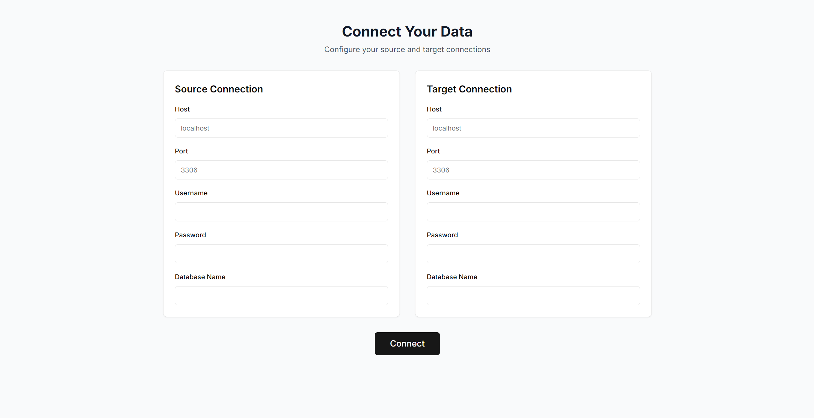
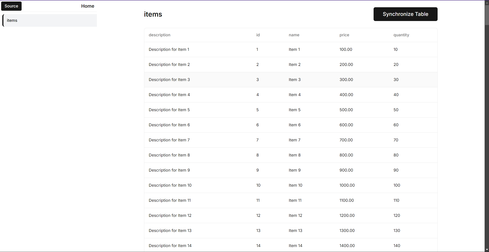

# Go-Sync-Data

`Go-Sync-Data` is a fullstack application that can be built, run, and managed using the included Makefile and Dockerfile. This project includes both backend and UI components.

## Prerequisites

- **Go**: Ensure you have Go installed for building the backend.
- **Node.js & npm**: Required to run the UI development server.
- **Docker**: Required for postgres setup and dumping data into the DBs.

## Screenshots

### HomePage


### Table View Page


---

## Docker Commands
```sh

// create an Image from the dockerfile
docker build -t go-sync-data .

// run the created docker image 
docker run -d --name postgres-container -p 5432:5432 go-sync-data

```


## Makefile Commands

The Makefile provides commands to manage the application. Below is a list of commands with descriptions.

### Build the Application

To compile the `syncData` backend application:

```bash
make build
```


### Run the Application


```bash
make start
```

### Stop the Application


```bash
make stop
```

### Install Dependencies in UI

```bash
make install_ui
```

### Run the UI

To compile the `syncData` backend application:

```bash
make start_ui
```